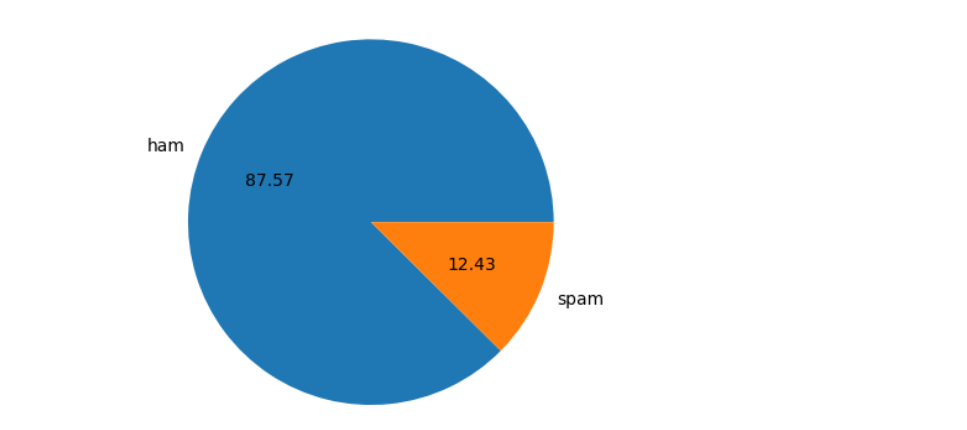
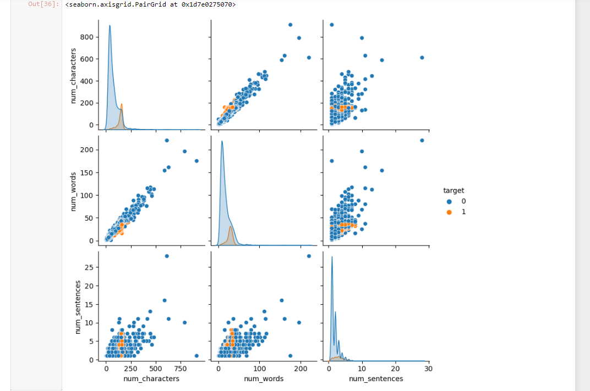
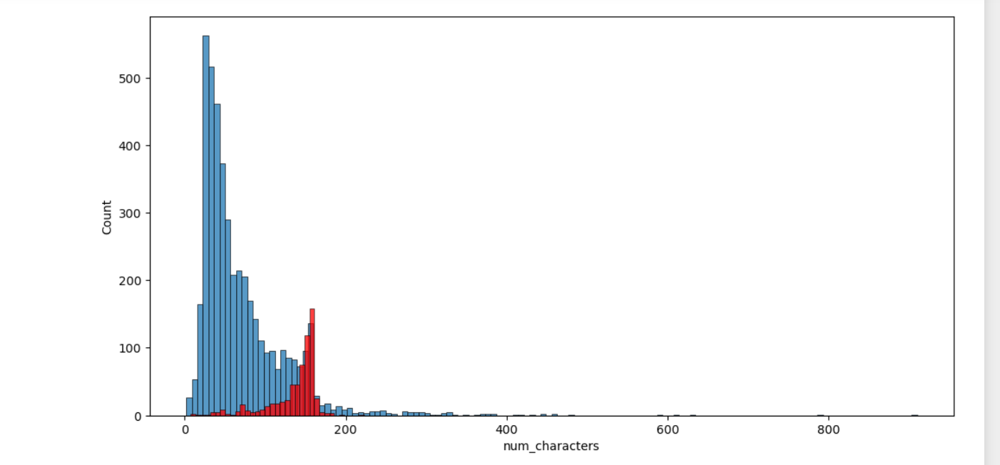
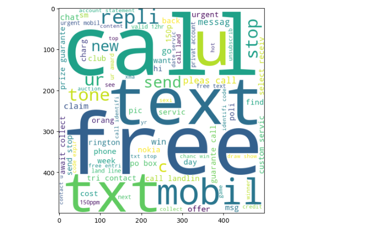
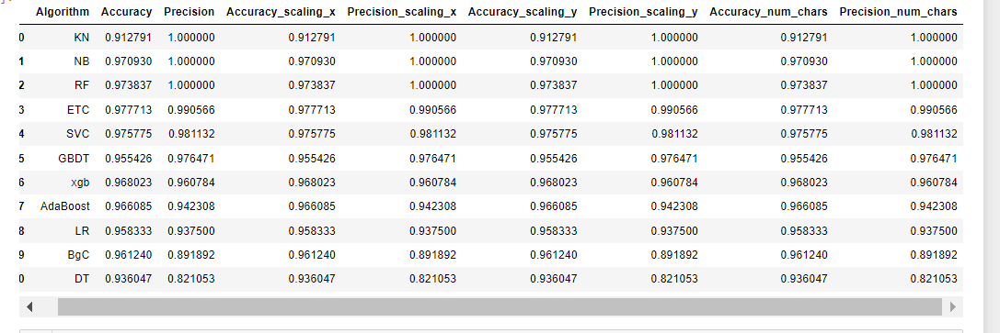
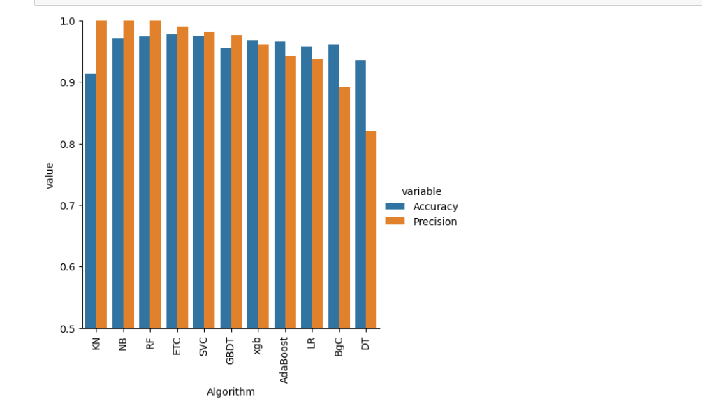
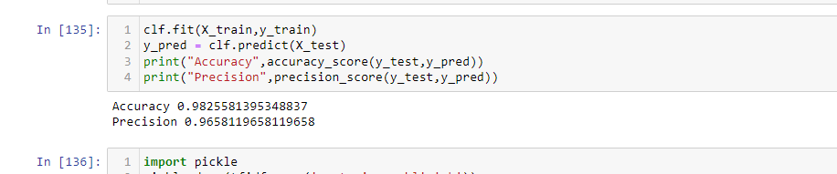
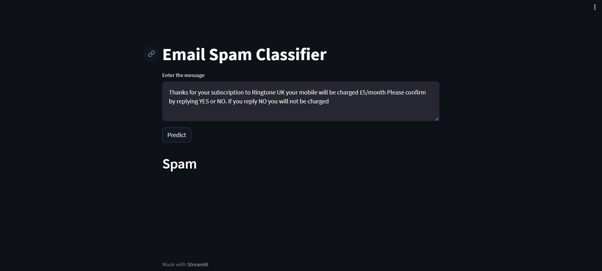
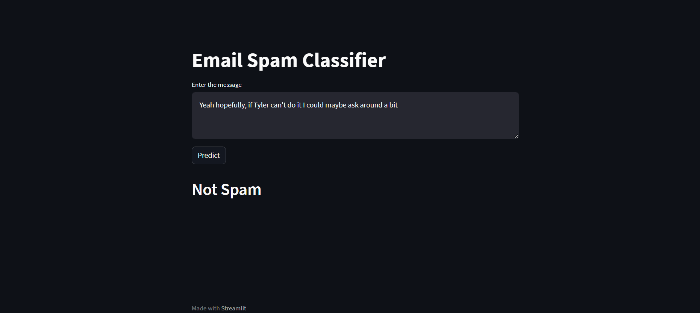

# Spam Mail Filtration

The objective of spam mail filtration is to automatically identify and separate unwanted, unsolicited, or potentially harmful emails (spam) from legitimate and desired emails (ham) in order to keep users' inboxes organized, reduce the risk of security threats, and enhance overall email communication efficiency.

## Stages of the Project:

### 1. Data Cleaning:
 - Removed duplicate and irrelevant emails from the dataset.
 - Handled missing values and applied necessary transformations to ensure data consistency.

### 2. Exploratory Data Analysis (EDA):
 - Visualized email categories using a pie chart created with Matplotlib.
 - Gained insights into the distribution of spam and non-spam emails.
 

### 3. Text Preprocessing:
 - Performed tokenization, converting email text into individual words or tokens.
 - Removed stop words, special characters, and numbers to focus on relevant content.
 - Applied stemming or lemmatization to standardize word forms.
 
 
 

### 4. Model Building and Comparison:
 - Utilized multiple classification algorithms such as Naive Bayes, Logistic Regression, and Support Vector Machines (SVM).
 - Split the data into training and testing sets for model evaluation.
 - Compared the performance of each model using metrics like accuracy, precision, recall, and F1-score.
 - Employed a voting ensemble method to combine predictions from multiple classifiers for improved performance.
 
 

### 6. Evaluation:
 - Achieved an impressive accuracy of 0.982, indicating the model's ability to correctly classify emails.
 - Attained a precision of 0.965, signifying the model's ability to minimize false positives (classifying non-spam as spam).
  

### 7. Streamlit Visualization:
 - Integrated Streamlit, a powerful Python library for creating interactive web applications, to visualize and present the project's results.
 
 